# Issue #49 — Verification

Restyle the existing surfaces with the design system, desktop-first. This is the
evidence pack the issue asks for: screenshots at 360/768/1280 in both themes,
exercise runs, a keyboard pass, and an accessibility audit.

> Screenshots were captured against the running app with the real 6ᵉ maths
> content. The nav grids show one class / one subject because that is all the
> catalogue currently publishes — the layout is built to hold more.

## Scope → delivery

| Issue scope | Delivered |
|---|---|
| 1. Desktop layout decided + documented (`PRINCIPLES.md`) | "Layout" section added to `PRINCIPLES.md`; decision = three-column study layout (chapter rail · reading column `max-w-[68ch]` · reserved tutor rail), rails fold to a `<details>` + bottom sheet below `lg` |
| 2. Restyle the four page types with the kit | `app/page.tsx`, `app/[niveau]`, `app/[niveau]/[matiere]`, `app/[niveau]/[matiere]/[slug]` rebuilt on tokens + kit |
| 3. Subject page = parcours language, no fabricated data | Ordered vertical sequence with hexagon step markers; only order + title + duration — no locks, XP, %, or streak |
| 4. Exercise widget rebuilt on the kit | `OptionRow` / `TextInput` / `Button` + inline `role="status"` result anchored to the card; full-width action on mobile |
| 5. T0 invariant preserved | No wrong-answer state reveals the expected answer — see note below |
| 6. Figures / formulas / rich text on tokens | KaTeX on the page ground (no code-block chrome); figures use `currentColor` (legible both themes); callouts use semantic token families |

Out of scope (untouched): the tutor panel itself (only its space is reserved),
sound feedback, and any page that does not yet exist.

## Automated checks

| Check | Result |
|---|---|
| `pnpm test` (Vitest) | **57 / 57 pass** |
| `pnpm lint` | 0 errors |
| `tsc --noEmit` | 0 errors (in-scope; the pre-existing `generated/schema` gap is produced by `pnpm generate:api`) |
| `pnpm build` | passes, all 10 routes |
| `scripts/check-tokens.sh` | passes (no raw colours / arbitrary sizes / inline fonts outside `tokens.css`) |
| `scripts/check-contrast.mjs` | 29 / 29 pairs pass |
| axe-core (accueil, parcours, chapitre @1280) | **0 violations** |

## T0 invariant — note for review

The widget never *mechanically* reveals the answer: the numeric `expectedValue`
is not rendered, and an un-selected correct multiple-choice option is never
highlighted on a wrong submission (only the student's own picks are marked). This
is covered by unit tests.

Separately, a wrong answer **opens the author's explanation** (per "a wrong answer
opens an explanation"). Some 6ᵉ explanations restate the reasoning, including the
result (e.g. *"6/3 = 6 ÷ 3 = 2"*). That is authored content, not a UI reveal — but
if T0 should also gate explanations on wrong answers, that is a small change plus a
content-authoring rule. **Flagging for a decision.**

The previous numeric widget printed `expectedValue` on a wrong answer, and a test
asserted it. That behaviour was removed and the test updated to assert
non-disclosure — a deliberate change required by scope 5, not a weakened test.

## Keyboard pass — chapter page

Tab order (recorded), all native elements with visible focus rings:

```
 1. a      "brio — accueil"
 2. a      "Sixième"                          (breadcrumb)
 3. a      "Mathématiques"                    (breadcrumb)
 4. button "Thème : Système"                  (theme toggle)
 5–8. a    chapter rail links (01…04)
 9. input  "Ta réponse"                       (first exercise)
10. button "Vérifier"
11–14. button  QCM options A–D
15. button "Vérifier"
… continues through every exercise, then the on-page summary links.
```

No keyboard trap; every control is reachable and operable.

## Screenshots — 4 pages × {360, 768, 1280} × {dark, light}

### Accueil
| | 360 | 768 | 1280 |
|---|---|---|---|
| Dark | 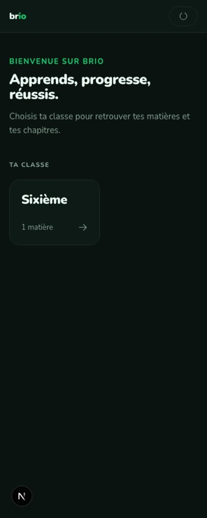 | 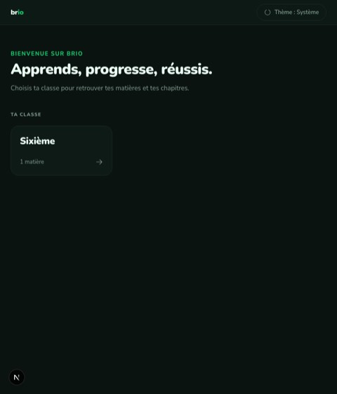 | 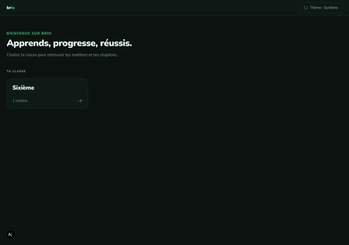 |
| Light | 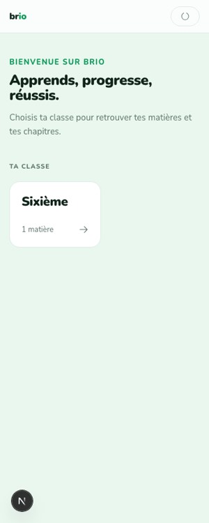 | 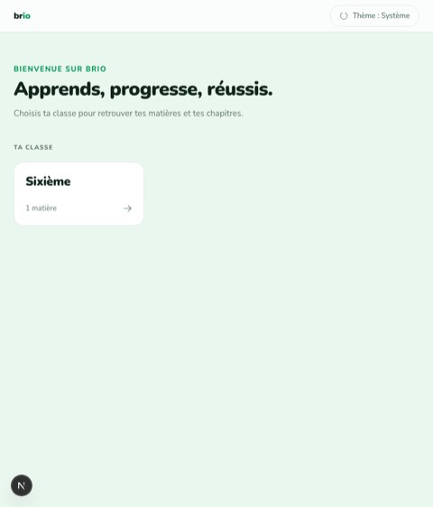 | 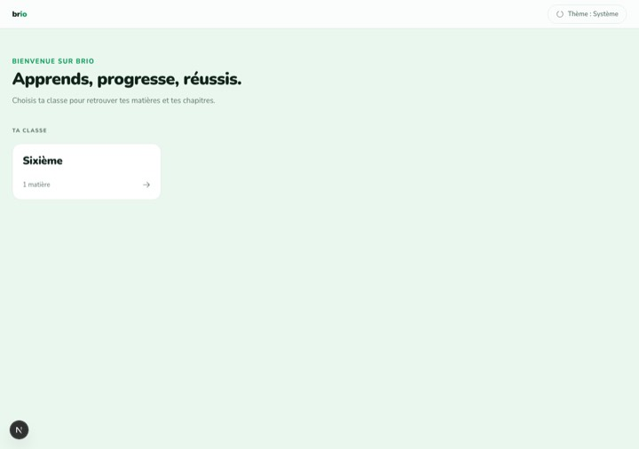 |

### Niveau (subject grid — holds six subjects without redesign)
| | 360 | 768 | 1280 |
|---|---|---|---|
| Dark | 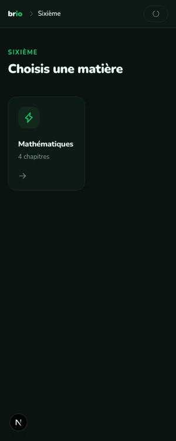 | 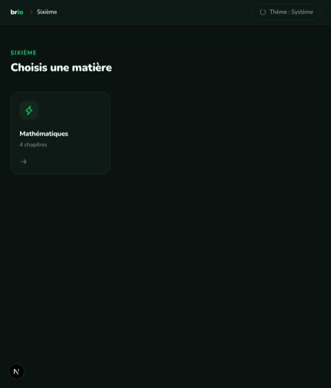 | 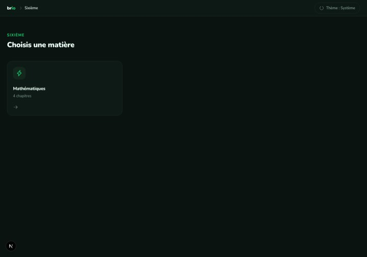 |
| Light | 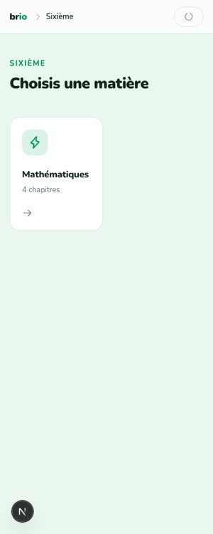 | 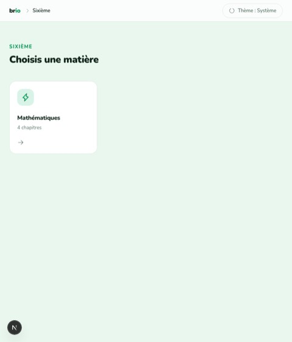 | 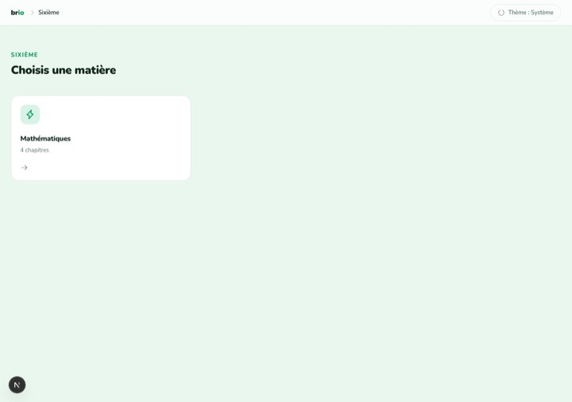 |

### Matière (parcours)
| | 360 | 768 | 1280 |
|---|---|---|---|
| Dark | 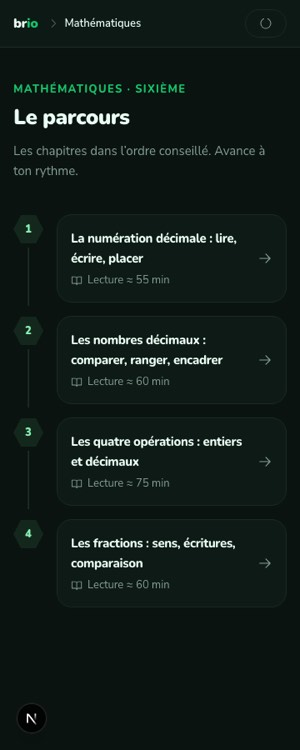 | 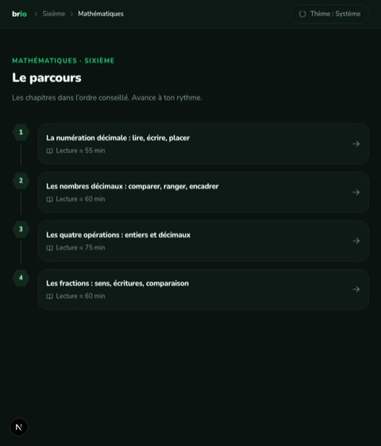 | 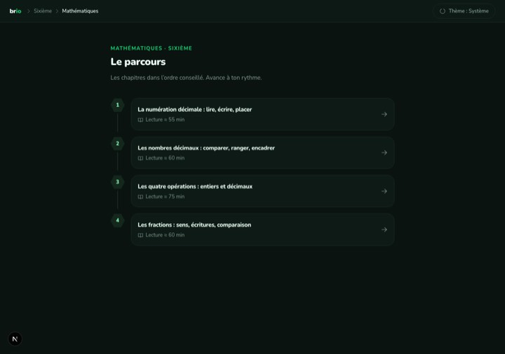 |
| Light | 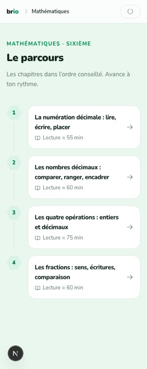 | 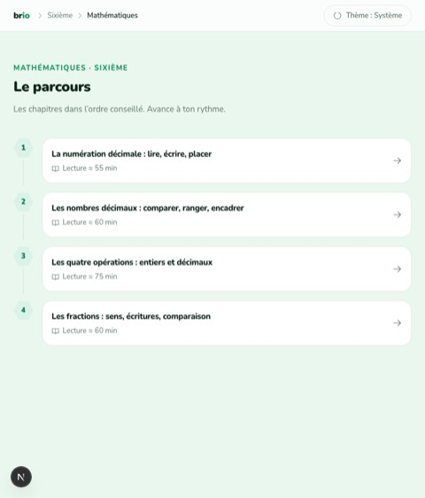 | 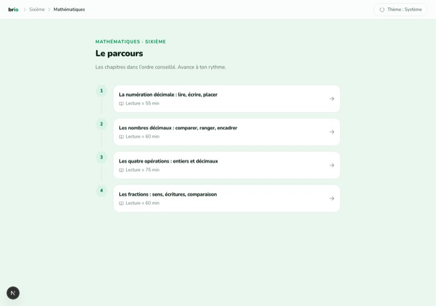 |

### Chapitre (three-column study layout)
| | 360 | 768 | 1280 |
|---|---|---|---|
| Dark | 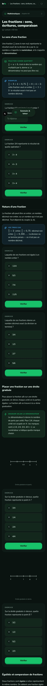 | 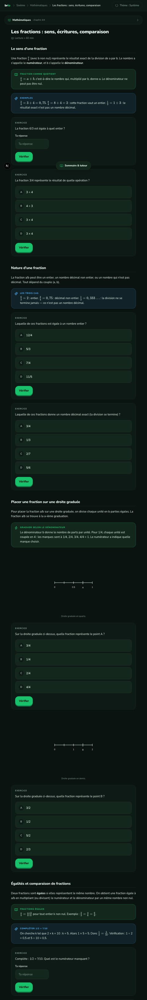 | 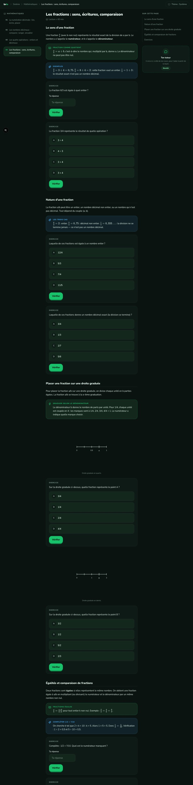 |
| Light | 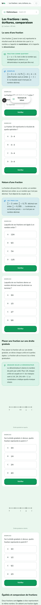 | 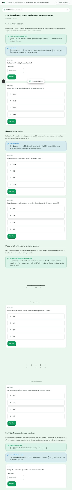 | 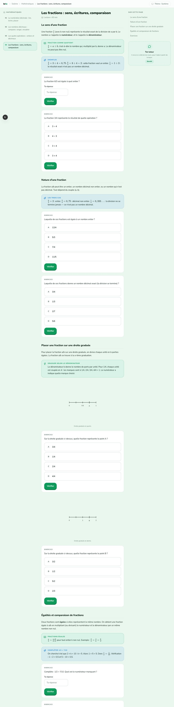 |

## Exercise runs (right / wrong / retry)

Multiple-choice — the student's wrong pick is marked; the correct option is **not**
revealed. Correct submission marks the pick and celebrates.

| QCM — wrong (1280) | QCM — correct (1280) | QCM — wrong (360) |
|---|---|---|
| 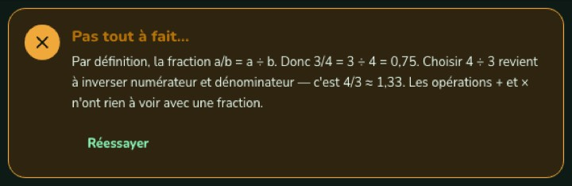 | 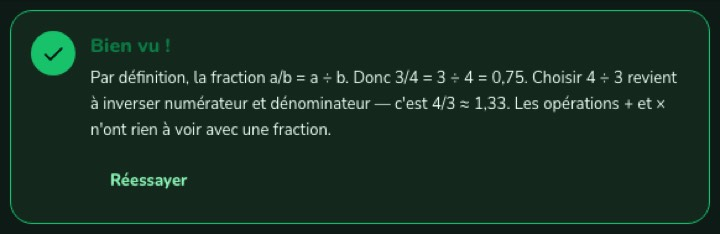 | 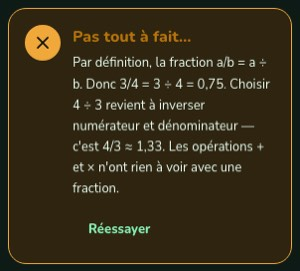 |

Numeric — the expected value is never printed on a wrong answer.

| Numeric — wrong (1280) | Numeric — correct (1280) | Numeric — wrong (360) |
|---|---|---|
| 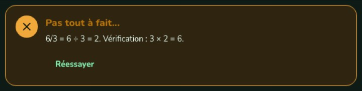 | 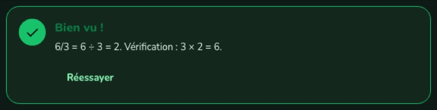 | 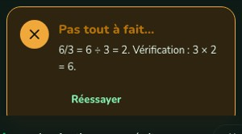 |

> Short-answer is exercised by unit tests: the 6ᵉ content set only ships
> multiple-choice and numeric exercises, so there is no short-answer surface to
> screenshot yet.
